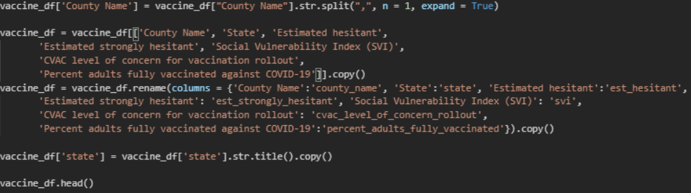
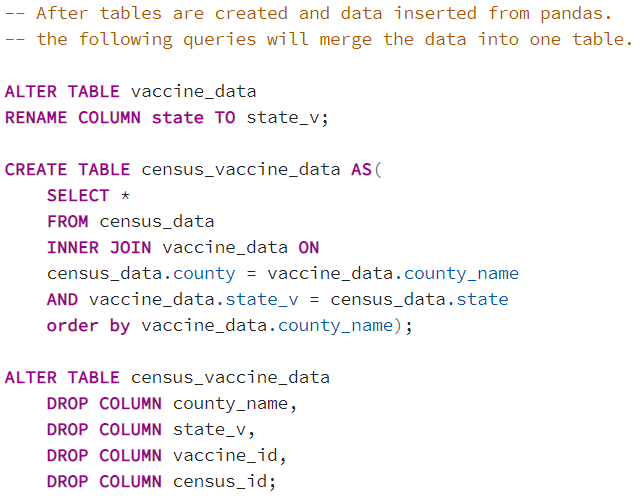
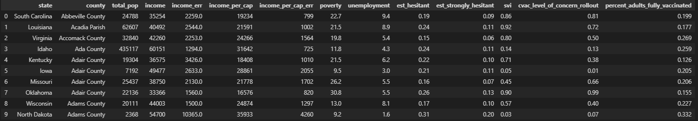

# COVID-19-Vaccine-Hesitancy-Dataset

* By Liang Lu, Natnael Tesfa, Anna Weeks, Marcus Potter

### Sources of Data:
* United States Census Bureau.(2017). US Census Demographic Data (Version 3) [CSV File].Retrieved from: https://www.kaggle.com/muonneutrino/us-census-demographic-data?select=acs2017_county_data.csv

* Data.Gov. (2021) Vaccine Hesitancy for COVID-19 (Version 1) [CSV File]. Retrieved from:
https://www.kaggle.com/deepshah16/vaccine-hesitancy-for-covid19?select=Vaccine_Hesitancy_for_COVID-19__County_and_local_estimates.csv

### Type of Final Production:
* PostgreSQL Database

### Descriptions of Findings:
* We realized Covid 19 vaccine hesitancy varies among different regions. We are interested in how economic factors, such as poverty, income level, and unemployment rate across different counties in the U.S. could affect Covid 19 vaccine hesitancy. As the result, people using the dataset can quickly check the correlation between these factors.

___________________________

## Project Report

### Extract:
* We started by loading both csv files into pandas. The Census demographics data set included over 3000 rows of data as it pulled from counties across the United States. It had 37 columns showing various attributes from ethnicity statistics, economic status, and specific job categories. The COVID vaccine hesitancy data similarly had over 3000 rows covering US counties, but this time looking at: perceptions of the vaccine, susceptibility to natural disasters, reported stress level due to vaccine availability, as well as geo-graphical location data including latitude & longitudinal county boundaries.

### Transform:
* To transform the data we first had to decide what aspects of each dataset we wanted to focus upon. From the census data we focused on economic factors as follows: reported income, income per capita, poverty rate, and unemployment rate. 

* From the vaccine data we kept factors that reflect hesitancy and level of concerns for vaccination. 

* For example, according to the data we used from Kaggle, “SVI (Social Vulnerability Index) refers to the potential negative effects on communities caused by external stresses on human health. Such stresses include natural or human-caused disasters, or disease outbreaks...Lower the SVI, the better it is.” 

* Additionally, CVAC is explained as: “level of concern captures supply- and demand-related challenges that may hinder rapid, widespread COVID-19 vaccine coverage in U.S. counties, through five specific themes: historic undervaccination, sociodemographic barriers, resource-constrained healthcare system, healthcare accessibility barriers, and irregular care-seeking behaviors. The CVAC measure is from 0 (lowest concern) to 1 (highest concern).”

* In order to format the data so they could be joined, we first drop the columns we didn’t need then we standardize our naming conventions between the dataframes as well as the eventual SQL database. A noteworthy fix we had to make was within the covid hesitancy data the county name was also including the state (ie: San Diego, CA). After fixing this we made sure that all of the columns followed the same rules for capitalization as well. A sample of our code making these changes can be seen below:

### Load:
* We created two SQL tables <vaccine_data> and <census_data> on postgres where the columns match the tables we cleaned. We used pandas to load data into SQL Database. We then joined two tables on “county_name” and “state” as we found there were several counties that existed in multiple states. Immediately afterwards we cleaned out redundant columns (repeat county and state names, and unnecessary reference id’s). The code can be seen below: 

* We included a query within our jupyter notebook that can allow users a quick access to the final table. Here is a quick preview:

* These data sets could provide insight into a complex and polarizing issue America is facing today. We feel that interested parties could quickly explore the economic factors and stressors that might affect vaccine hesitancy.

Note: A file (config.py) will need to be created, for importing a postgress username and password to the jupyter notebook, in order to run the notebook and add data to database tables.
